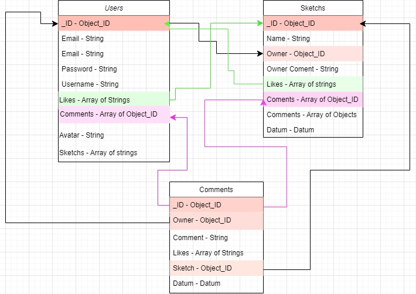

# Project 4: Spike 4

## SQL and Non SQL databases

**SQL** (**Structured Query Language**) refers to databases that use relationships between entries to reduce storage. Instead of duplicating data in multiple places, a link is established to the base location of some data. Relational databases were much more popular back when digital storage was more expensive. Now that developer wages far outweigh the price of storage, the priority is to make _using_ the databases simpler and faster, even if documents are much larger. 

MongoDB is a [**NoSQL**](https://www.mongodb.com/nosql-explained) database, which means there isn't a direct relationship between documents. But we can create something similar by using document IDs and Mongoose's [populate](https://mongoosejs.com/docs/populate.html) methods. The upside for this is that you aren't having to update the same data in multiple locations every time you make a change. The downside is that requesting the data can take longer because you need to make a separate request for each 'linked' document.

## Populate

To follow the example given in the LMS, each user can have pets - they could have no pets, one pet, or multiple pets. This is known as a **one to many** relationship. The pets will be held in a separate collection, each pet is it's own document. Each pet can have only one owner, and a pet cannot exist without an owner. This is known as a **many to one** relationship. 

We will need to create a Schema and Model for our pets, along with a routes and controller document to hold the routes and functions. I'll also need to update my userSchema to include a property for pets. Where the documents reference each other, we'll put type: `mongoose.Schema.Types.ObjectId` (this could be condensed into a variable for more readable code), and a **ref** property that will reference the **singular**, **lower-case** name of the collection where the documents to be populated can be found. eg:

```js
const objectId = mongoose.Schema.Types.ObjectId;

const petSchema = new mongoose.Schema({
  animal: { type: String, required: true },
  name: { type: String, required: true },
  owner: { type: objectId, ref: 'user', required: true }
});
```

Make sure to update the UserModel as well. If I don't populate the data, I will get just the ObjectId, so once I've also manually updated my MongoDB documents to reflect my new Schemas, I'll need to use the `populate()` method to populate the 'pets' property with the relevant data:

```js
const getAllUsers = async(req, res) => {
  try {
    const users = await User.find().populate("pets");
    res.status(200).json(users);
  } catch(e) {
    console.log(e);
    res.status(500).json({ error: "something went wrong..." })
  }
}
```

Say, though, that we have private data on our 'user' document. The above method fills the space with the whole document, but we can be more specific. We might only want to pass the user's username and avatar, for example. We want to keep private data, like their email and password, private! So we can specify which properties are to be included (Mongoose docs leave out this object format, but I think it gives clarity):

```js
const getAllWithOwner = async(req, res) => {
  try {
    const pets = await Pet.find().populate({ path: 'owner', select: ['username', 'email'] });
    // const pets = await Pet.find().populate('owner', ['username', 'email']); // without object format
    res.status(200).json(pets);
  } catch (e) {
    console.log(e);
    res.status(500).json({ error: "something went wrong..." })
  }
}
```

It's worth making some visual aids for yourself at this point, so you can keep track of how your documents and collections relate to each other. [This](https://app.diagrams.net/) is a great free resource for building diagrams - here's an example made my a previous student:




## Transactions

**Transactions** should be used when the set of database operations you are making needs to be **atomic**, ie. they _all_ need to succeed, or all changes should be reverted.. The transaction ensures that the database is always in a consistent state.

[Docs link](https://mongoosejs.com/docs/transactions.html#advanced-usage)